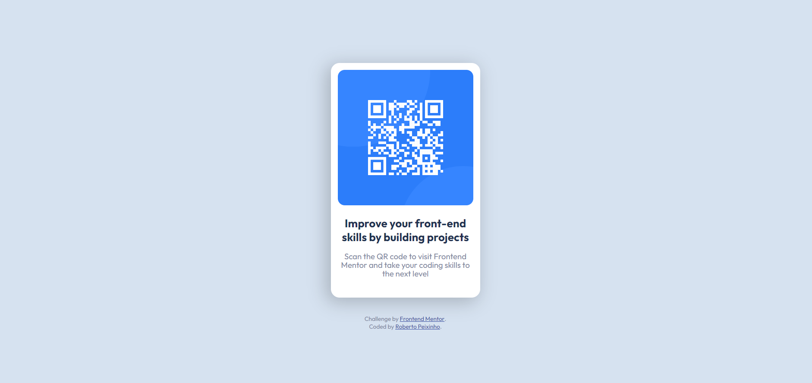

# Frontend Mentor - QR code component solution

This is a solution to the [QR code component challenge on Frontend Mentor](https://www.frontendmentor.io/challenges/qr-code-component-iux_sIO_H). Frontend Mentor challenges help you improve your coding skills by building realistic projects.

## Table of contents

- [Overview](#overview)
  - [Screenshot](#screenshot)
  - [Links](#links)
- [My process](#my-process)
  - [Built with](#built-with)
  - [What I learned](#what-i-learned)
- [Author](#author)

## Overview

### Screenshot

### Links

- Solution URL: [Add solution URL here](https://github.com/Pexex/qr-code-component-main)
- Live Site URL: [Add live site URL here](https://pexex.github.io/qr-code-component-main/)

## My process

### Built with

- Semantic HTML5 markup
- CSS custom properties
- Flexbox

### What I learned

This project was just a fun moment while i was bored, so, doing this project i've just used some of the knowlegd i already have.

## Author

- GitHub - [@Pexex](https://www.github.com/pexex)
- Frontend Mentor - [@yPexex](https://www.frontendmentor.io/profile/Pexex)
- Instagram - [@yPexex](https://www.instagram.com/pexex)
